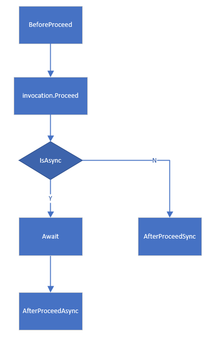

# lightwind

Lightweight dotnet core help libraries for aop.

install with nuget:
```
dotnet add package Lightwind.Asyncinterceptor
dotnet add package Lightwind.DynamicProxyExtension
```

## Lightwind.Asyncinterceptor

`Lightwind.Asyncinterceptor` is a help library to simplify the use of Castle.Core dynamic proxy with async interceptors.  
It is inspired by :  <https://stackoverflow.com/a/39784559/7726468>  


`Lightwind.Asyncinterceptor` can work with `Autofac.Extras.DynamicProxy` to make [asynchronous method interception](https://autofac.readthedocs.io/en/latest/advanced/interceptors.html#asynchronous-method-interception) easier.  Autofac asyncinterceptor code sample can be found [here](https://github.com/wswind/lightwind/tree/main/samples/AutofacAsyncInterceptor).

[中文介绍](https://devws.cn/posts/autofac-asyncinterceptor/)


You can create your own async interceptor class inherited from [AsyncinterceptorBase](https://github.com/wswind/lightwind/blob/main/src/Lightwind.AsyncInterceptor/AsyncInterceptorBase.cs) to use this package.  

There are just three methods to override for your own intercteptor:
```csharp
protected virtual void BeforeProceed(IInvocation invocation);

protected virtual void AfterProceedSync(IInvocation invocation);

protected virtual Task AfterProceedAsync(IInvocation invocation, bool hasAsynResult);
```

`Task / Task<TResult> / ValueTask / ValueTask<TResult>` return types can be handled automaticly.

AsyncinterceptorBase running processes:  


AsyncinterceptorBase blocks Tasks running using async await, return values can be changed at interceptor AfterProceedAsync, check the sample [here](https://github.com/wswind/lightwind/blob/main/samples/AutofacAsyncInterceptor/CallLoggerAsyncInterceptor.cs).  
alternatives:  <https://github.com/castleproject/Core/blob/master/docs/dynamicproxy-async-interception.md#closing-remarks>

## Lightwind.DynamicProxyExtension

`Lightwind.DynamicProxyExtension` is a help library for aop interceptors with just Microsoft's default IoC framework (Microsoft.Extensions.DependencyInjection) + Castle.Core.
This package aims to help people who want to implement aop but don't like to use third party IoC frameworks (like autofac, dryioc).

```
services.AddDynamicProxyService<IHelloRobot>(sp =>
{
	return new HelloRobot();
}, ServiceLifetime.Transient, new MyInterceptor());
```

sample: <https://github.com/wswind/lightwind/tree/main/samples/MSDIWorkWithCastle>  
