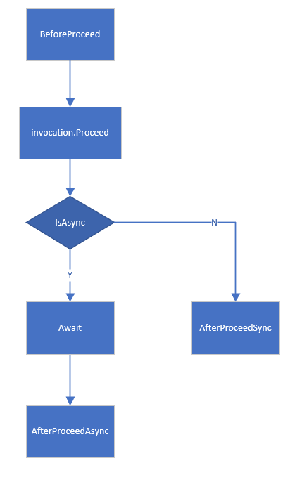

# lightwind

light weighted help libraries for dotnet which includes:

1. Lightwind.Asyncinterceptor
2. Lightwind.DbConnection 

install with nuget:
```
dotnet add package Lightwind.Asyncinterceptor
dotnet add package Lightwind.DbConnection
```

## Lightwind.Asyncinterceptor

`Lightwind.Asyncinterceptor` is a help library for async interceptors to use with Castle.Core,
which is inspired by : <https://stackoverflow.com/a/39784559/7726468>  
Just create your own async interceptor class inherited from AsyncinterceptorBase to use it.

AsyncinterceptorBase running processes:



## Lightwind.DbConnection 
`Lightwind.DbConnection` is a help library of DbConnection Factory to use with dapper/ado.net in Asp.NET Core.

Using DbConnectionFactory：
1. set dbconnection string in appsettings.json 
2. pass the dbconnection string name to DbConnectionFactoryExtensions.AddSingletonDbConnectionFactory() 
3. use IDbConnectionFactory with di


## code samples
samples: <https://github.com/wswind/lightwind/tree/master/samples>